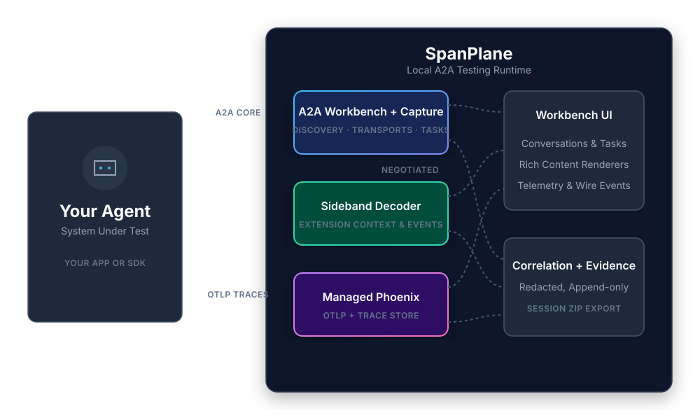

# Architecture

The application is a local-first modular monolith. A single Node command owns process lifecycle, while protocol handling, evidence capture, sideband interpretation, telemetry configuration, export, and presentation remain separate modules with explicit contracts.

  

## Module boundaries

| Area | Location | Responsibility |
| --- | --- | --- |
| Protocol gateway | `src/lib/spanplane-gateway.ts` | Official SDK clients, transport selection, v1/v0.3 compatibility, extension activation |
| Evidence contracts | `src/shared/evidence` | Product-neutral records and correlation identifiers shared by server and UI |
| Runtime configuration | `src/server/runtime` | Runtime-resolved flags, storage location, sideband URIs, telemetry endpoints |
| Evidence persistence | `src/server/evidence` | Append-only repository interface, file implementation, redaction, capture helpers |
| Sideband | `src/server/sideband` | Agent Card negotiation and deterministic metadata decoding |
| Export | `src/server/export` | Reproducible chronological and source-specific ZIP bundles |
| Local process supervisor | `bin` | Starts and stops Node plus the managed, pinned telemetry runtime |
| Content presentation | `src/components/PartRenderer.tsx` | Shared rendered, structured, and feature-flagged raw views |

## Runtime model and OpenTelemetry Collector

`npx spanplane` is the only required application command. To provide an **out-of-the-box OpenTelemetry (OTel) Collector**, the CLI automatically provisions and manages an [Arize Phoenix](https://phoenix.arize.com/) instance locally. 

- On the first run, it transparently creates an isolated Python virtual environment beneath the `.spanplane-data` directory and installs the required Phoenix dependencies.
- It starts the Phoenix OTel collector on loopback, selecting unused ports automatically.
- It injects the resolved `OTLP` instrumentation endpoints (HTTP/gRPC) into the Node child process so the UI can display them to the user.
- Any OTel-compliant agent can point directly to this endpoint to stream Gen AI metrics without any external infrastructure.

An existing Phoenix deployment can also be selected with `A2A_PHOENIX_BASE_URL`; no backend-specific project name is required.

Telemetry modes are:

- `auto` — start managed Phoenix, but keep A2A and sideband available if telemetry setup fails.
- `required` — fail startup when the telemetry runtime cannot be started.
- `off` — do not start or configure a trace provider.

## Evidence model

Evidence is append-only and each record contains:

- `sessionId` and `requestId` for local interaction boundaries;
- a source (`a2a`, `sideband`, `otel`, or `runtime`);
- direction and a stable event kind;
- an ISO timestamp;
- optional A2A and OTEL references (`contextId`, `taskId`, `messageId`, `artifactId`, `traceId`, `spanId`);
- the captured payload after recursive secret-field redaction.

The UI derives conversations, task state, artifacts, and event views from source evidence. It does not label an execution “healthy” or “unhealthy”; it exposes protocol facts and correlations so the developer can make that determination.

## Design invariants

1. A2A remains useful without sideband or telemetry.
2. Sideband is activated only through Agent Card discovery and extension negotiation.
3. Extension metadata never changes the core A2A data structures.
4. Rich rendering is deterministic from part discriminator and media type.
5. Raw visibility is a runtime UI policy, independent from evidence capture and export.
6. Credentials are not written to evidence files; recognized secret fields are redacted recursively.
7. Phoenix is a replaceable trace provider, not a proprietary data contract.
8. Product identity is presentation/package metadata, not a persistence, correlation, or telemetry key.

## Evolution path

The file repository is intentionally behind `EvidenceRepository`, allowing SQLite or another durable store without changing routes or UI contracts. Phoenix query/correlation belongs behind a trace-provider interface; additional providers should translate OTEL records into the shared evidence model rather than leak vendor schemas into components. Protocol extensions beyond sideband should get their own negotiator and decoder module.
